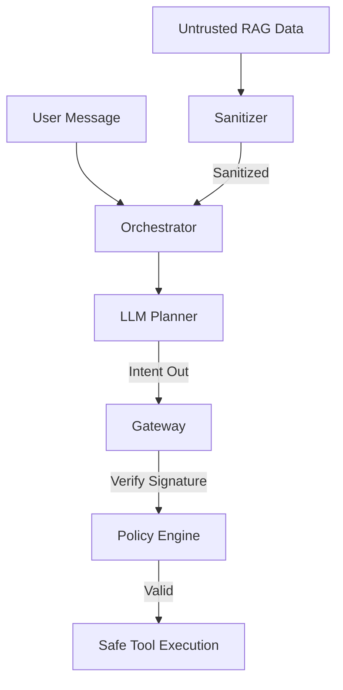

# Secure LLM Platform | Full-Stack Gateway

A production-grade, security-hardened LLM platform designed to mitigate prompt injection through **Data Plane Isolation** and **Capability-Based Security**.

## 🛡️ Core Security Features

*   **Multi-Channel Input Isolation**: Strictly separates `system`, `user`, and `retrieved (RAG)` data into isolated channels, preventing the LLM from conflating untrusted data with system instructions.
*   **HMAC-Signed Capability Tokens**: Every tool execution requires a short-lived, cryptographically signed token issued by the Control Plane. The LLM cannot self-authorize tool calls.
*   **Three-Layer Sanitization Pipeline**:
    *   **L1 (Regex)**: Fast rejection of known prompt injection patterns.
    *   **L2 (Classifier)**: Probabilistic risk scoring for adversarial inputs.
    *   **L3 (Transformation)**: Neutralizes instructional verbs into passive text, breaking the chain of execution for untrusted RAG content.
*   **Hardened Tool Gateway**: Enforces strict regex and numeric constraints on all tool parameters before final execution.

## 🚀 Full-Stack Overview

### Backend (Python/FastAPI)
- **Dynamic Orchestrator**: Supports real-time switching between OpenAI, Anthropic, and Custom LLM providers.
- **Stateless Tokens**: Fast, HMAC-BASED verification with no database overhead.
- **Tool Registry**: Securely managed tool definitions with delegated execution.

### Frontend (React/Vite)
- **Trust-First UI**: Visualizes real-time `TrustScore` and sanitization status for all RAG sources.
- **Glassmorphism Chat**: A premium dark-mode interface with thought-process transparency.
- **Advanced Configuration**: Live model selection and endpoint customization.

## 🛠️ Quick Start

### 1. Backend Setup
```bash
# Initialize environment
python -m venv venv
source venv/bin/activate
pip install -r requirements.txt

# Start the secure server
uvicorn src.main:app --host 0.0.0.0 --port 8000
```

### 2. Frontend Setup
```bash
cd frontend
npm install
npm run dev
```

### 3. Verification
```bash
# Run security boundary tests
pytest tests/test_security.py
```

## 📐 Architecture



---
**Secure LLM Platform** - Built for Staff-level Security and Planet-scale Reliability.
