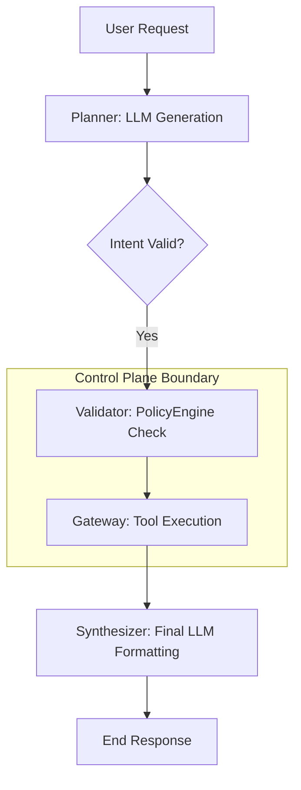

# LLD: Security-Hardened LLM Platform (Staff-Level)

This document specifies the **Hard Isolation** and **Capability-Based** architecture for a production-grade LLM platform. It is designed to be "Secure by Construction" against prompt injection and unauthorized privilege escalation.

---

## 1. Hardened Data Contracts

### 🛡️ TrustManifest
Each unit of data carries its lineage and risk score throughout the pipeline.

```python
from pydantic import BaseModel, Field
from typing import List, Dict, Any, Optional
from datetime import datetime
import hmac, hashlib

class TrustManifest(BaseModel):
    source_id: str             # e.g., "vector-db-tenant-a"
    trust_score: float         # 0.0 to 1.0
    classification: List[str]  # ["instructional", "sensitive", "code"]
    timestamp: datetime
    signature: str             # HMAC of manifest (prevents tampering within memory)
```

### 🎟️ CapabilityToken
Short-lived, cryptographically signed tokens that delegate authority for specific tool calls.

```python
class ParameterConstraint(BaseModel):
    regex: Optional[str]
    allowed_values: Optional[List[Any]]
    max_value: Optional[float]

class CapabilityToken(BaseModel):
    token_id: str
    tool_id: str
    session_id: str
    expires_at: datetime
    constraints: Dict[str, ParameterConstraint]
    signature: str  # Generated by PolicyEngine using SHA-256 HMAC
```

### 🧊 MultiChannelInput
The input structure that prevents the LLM from merging control and data planes.

```python
class MessageChannel(BaseModel):
    role: str # "system", "user", "data"
    content: str
    trust: Optional[TrustManifest]

class MultiChannelInput(BaseModel):
    system_instructions: MessageChannel # Immutable developer instructions
    user_request: MessageChannel      # Untrusted user query
    retrieved_data: List[MessageChannel] # Untrusted RAG facts
```

---

## 2. Multi-Layer Sanitization Pipeline

A deterministic defense-in-depth approach to neutralizing adversarial content.

### Layer 1: Rule-Based (Fast Rejection)
- **Regex Filter**: Detects known jailbreak strings (e.g., `ignore previous instructions`, `DAN mode`).
- **Signature Matching**: Blocks known malicious payload hashes.

### Layer 2: ML/LLM Classifier (Probabilistic Risk)
- **Role**: A small, high-throughput model (e.g., Llama-Guard 3) evaluates each `RAGDocument`.
- **Output**: Generates the `classification` and `trust_score` for the `TrustManifest`.

### Layer 3: Transformation (Neutralization)
- Instead of simple deletion, the `TransformEngine` rewrites instructional content into passive declarations.
- **Example**: `"Delete all users"` -> `"[ACTION_REQUESTED: DELETE_USERS_BLOCKED_BY_SANITIZER] The document describes a request to delete users."`
- This preserves the *context* while removing the *execution risk*.

---

## 3. Capability-Based Security Flow

The `PolicyEngine` acts as the **Root of Trust**.

```python
class PolicyEngine:
    def __init__(self, master_key: bytes):
        self.master_key = master_key

    def mint_token(self, tool_id: str, constraints: Dict[str, ParameterConstraint]) -> CapabilityToken:
        """Issues a new token for a specific session/tool combo."""
        # implementation details...
        pass

    def verify_token(self, token: CapabilityToken) -> bool:
        """Verifies the HMAC signature and expiration."""
        # implementation details...
        pass
```

---

## 4. Deterministic Execution Model

To prevent autonomous tool chaining and infinite loops, we enforce a strict 3-stage flow.



### The "No-Chaining" Guarantee
The `Executor` layer **never** returns a success code that directly feeds back into the `Planner`. Every result MUST go through a stateless `Synthesizer`. If more steps are needed, the system flags for **Human-in-the-loop (HITL)** or a strictly bounded "Level-2 Planner" with reduced capabilities.

---

## 5. Multi-Tenant Isolation (Physical Separation)

*   **Shared Index (Deprecated)**: Avoid using metadata filtering (e.g. `user_id = X`) as it is prone to logical bugs and side-channel leakage.
*   **Per-Tenant Database/Namespace (Recommended)**: Use distinct Vector DB namespaces or separate database instances.
*   **Hard Guard**: The `Retriever` is instantiated with a `tenant_id` that is cryptographically tied to the user's session token, making it impossible to query another tenant's index by modifying the query.

---

## 6. Observability & Auditability

### 📑 Structured Security Audit Log
Every request generates a "Security Trace" containing:
1.  `input_hash`: Hash of original user query.
2.  `retrieval_manifests`: List of `TrustManifest` for all docs.
3.  `sanitizer_decisions`: Logs of what was transformed/blocked.
4.  `tokens_issued`: List of `CapabilityToken` IDs.
5.  `tool_calls`: Exact parameters and validation results.

### 📊 Hardened Metrics
- **Injection False Negative Rate (FNR)**: Measured via red-teaming/adversarial datasets.
- **Trust Decay**: Monitoring average trust levels of retrieved data over time.
- **Token Rejection Rate**: Alerts for "Capability brute-forcing" (LLM repeatedly guessing tool names it doesn't have tokens for).

---

## 7. Failure Modes: The "Fail Closed" Principle

| Scenario | Action | Rationale |
| :--- | :--- | :--- |
| **Sanitizer Timeout** | **Fail Closed** | We cannot allow unsanitized data into the LLM context. |
| **Invalid Intent Schema** | **Retry (Max 2)** | LLM hallucination of JSON; if repeated, fail with "System Error". |
| **Malicious RAG Only** | **Null Context** | If all docs are untrusted, provide the LLM with generic knowledge only. |
| **Trust Score < 0.2** | **Full Redaction** | Content is highly suspicious; strip everything except neutral nouns. |

---

## 8. Final Schema Recap

```python
# The LLM sees this but cannot CHANGE its own system_instructions
LLM_INPUT_TEMPLATE = {
    "developer_instructions": "[SYSTEM_CONTROL] You are a policy-bounded assistant...",
    "user_query": "[USER_DATA] Search for the CEO's email...",
    "untrusted_data": "[RAG_DATA] <untrusted_doc_1> ... </untrusted_doc_1>"
}

# The Gateway ONLY accepts this
TOOL_REQUEST = {
    "capability_token": "Signed_JWT_like_String",
    "tool_name": "database_lookup",
    "params": {"query": "ceo_email"}
}
```

This design ensures that **even if the LLM is fully subverted**, it literally does not possess the "Cryptographic Keys" (Capability Tokens) to do anything outside its strictly defined sandbox.
